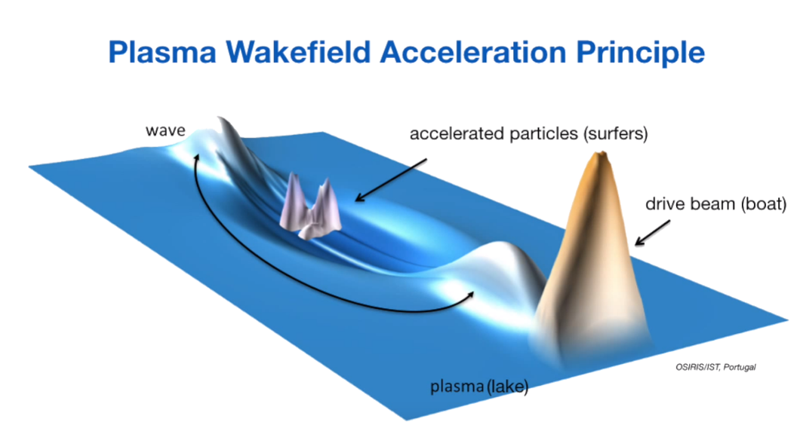
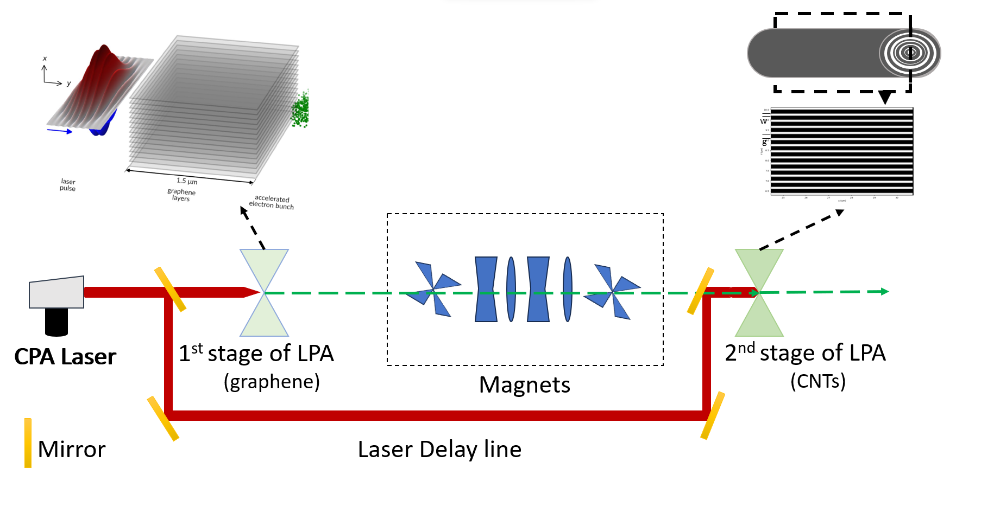
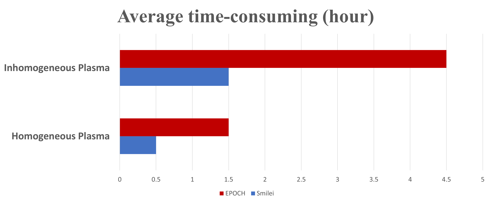
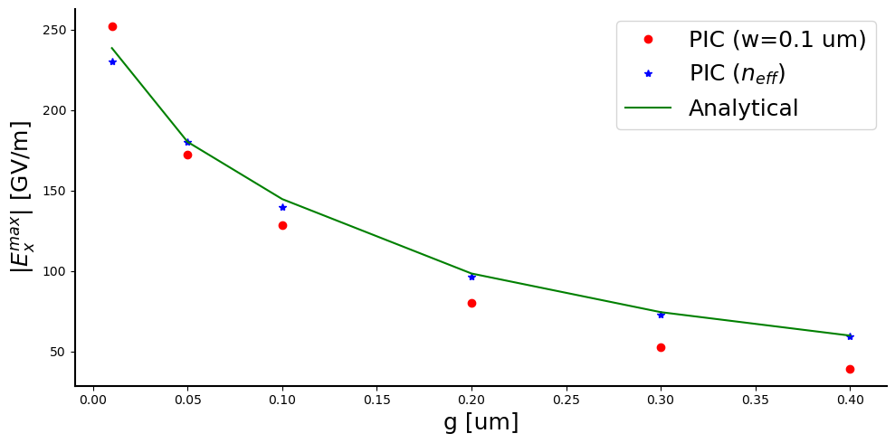

The large-scale and high-cost nature of particle accelerators has driven scientists to seek alternative acceleration methods. Among these promising alternatives, solid-state materials like Carbon Nanotubes (CNTs) have emerged as candidates offering tremendous acceleration potential through the phenomenon of Laser Wakefield Acceleration.
<figure>
  
  <figcaption>Figure 1: Credit: [Dr. Edda Gschwendtner's Ted talk]</figcaption>
</figure>

In the accelerator community, wakefield is metaphorically described as waves inside a lake and it works as follows: consider the plasma environment as a lake, where a boat (a drive beam) creates waves (electron oscillations) as it moves. Using these waves, a surfer (injected particles) can carry him/herself just behind the boat (see Fig.1). 

A fundamental challenge lies in the absence of explicit analytical expressions to fully grasp the behavior of this complex phenomenon,
necessitating reliance on numerical models. Our research addressed this challenge by integrating both approaches. From the analytical perspective, an investigation of a novel approach called
**”effective density”** was done to analyze wakefields driven by lasers in inhomogeneous high-density plasma based on CNTs. On the numerical front, two well-known Particle-In-Cell (PIC) codes were introduced, and benchmarking was done to determine the most suitable one for our specific case. Excitingly, our comparison between the analytical effective density approach and numerical results revealed a remarkable agreement across different scenarios. The findings showed the potential of the
effective density method in effectively describing wakefield behavior in CNTs and its correlation with the numerical simulations. Moreover, The investigations delved into the limits of the effective density approach, examining how different parameter variations impact the alignment between the numerical model and the analytical expression.

<figure>
  
  <figcaption>Figure 2 : Initial schematic of the first two stages of the multi-TeV mini accelerators. The
CPA laser generates the required laser beam (red arrow) to interact with ionized graphene (leftside
Collate shape), resulting in the generation of LWFA and the electron bunch (green arrow).
Subsequently, the laser is reflected to generate wakefield inside the preionized CNTs (right-hand
side collate shape). Specialized magnet instruments (blue-color shapes) are utilized to preserve the
initial injected electron bunch and synchronize its injection into the CNTs</figcaption>
</figure>

 The thesis came to a close by shedding light on the intriguing possibility of multi-stage TeV/m acceleration using solid-state plasma(See Fig.2).

Following an in-depth exploration of Laser Wakefield acceleration principles, the thesis culminates in the following conclusion:

**1**: The validation and comparison of two PIC codes, Smilei and EPOCH, demonstrated their reliability
for simulating laser wakefield acceleration. However, Smilei emerged as the preferred
choice due to its superior user-friendliness, extensive options, and enhanced efficiency. The simulations
were carried out using the same cluster and showcased Smilei’s ability to significantly
reduce computation time compared to EPOCH in the context of homogenous and inhomogeneous
plasmas (see Fig.3).
<figure>
  
  <figcaption>Figure 3 : Comparison of average computing time for two PIC codes, Smilei and EPOCH, in
both inhomogeneous and homogeneous cases.</figcaption>
</figure>

**2**: The analysis of the effective density approach for different scenarios and parameters reveals
important insights. It can be concluded that the effective density approach provides an average
or mild expression for inhomogeneous laser wakefield acceleration. The effective density demonstrates good alignment with existing analytical approaches for gaseous plasmas.
The results indicate that the effective density approach works well in low-density and linear
regimes, where it accurately describes the behavior of the wakefield. It also remains reliable in
scenarios with mild discontinuities, where the collective behavior of the plasma can still smooth
out the discontinuity and maintain alignment with the inhomogeneous PIC simulation.
However, as the discontinuity becomes more pronounced, the effective density approach becomes
less reliable in describing the behavior of the wakefield. For example, when increasing
the gap size of CNTs, the existing analytical approach fails to capture the behavior accurately(see Fig.4).
Nonetheless, the effective density approach can still provide reasonable estimations, at least in the
initial phases. Nevertheless, as the discontinuity increases further, the collective behavior of the
plasma fails to smooth out the discontinuity, causing the effective density approach to deviate from
the inhomogeneous PIC simulation.

<figure>
  
  <figcaption>Figure 4: Numerical and expected analytical estimates of E_max by varying the gap width for a
CNT array with w = 0.1 μm, and equivalent homogeneous plasma (using effective density), at a
propagation distance of x = 52.39 μm.</figcaption>
</figure>

**3**: After conducting an investigation into the analytical approaches for describing LWFA on inhomogeneous
plasma based on CNT arrays, a numerical analysis was performed to explore the
potential of CNT arrays for accelerating particles in the TeV range. The simulation was carried out
for a CNT array with a density of approximately 1 × 10^26 m^−3, a wall width (w) of 0.2 μm, and a
gap (g) of 0.1 μm. The results indicate that an electron bunch with a total charge of around 2.5 pC
was accelerated within the range of TeV/m (see Fig. 5).
<figure>
  
  <figcaption>Figure 5: Evolution of the mean value of the kinetic energy of the witness bunch at various
longitudinal positions during its laser-driven acceleration inside the CNT array.</figcaption>
</figure>

**The combined findings from this study and previous research suggest that the concept of multistage
TeV acceleration by solid-state plasma is attainable. However, achieving such capabilities
poses significant experimental challenges. More in-depth studies, whether analytical or numerical,
are imperative to explore this avenue further. In this context, the Effective density approach
presents a promising starting point, as demonstrated in this report.**
